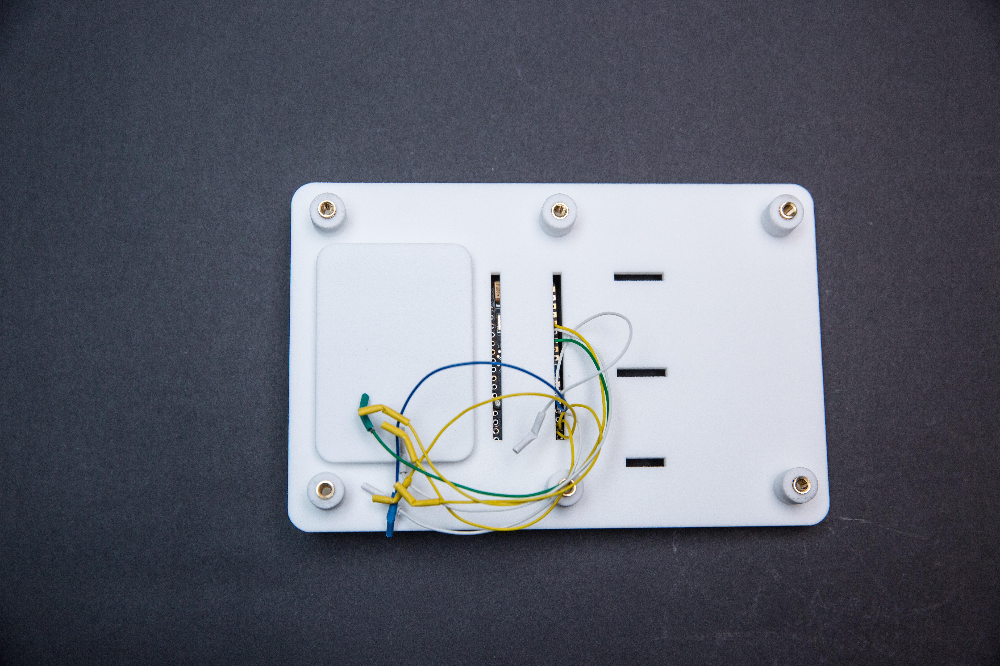
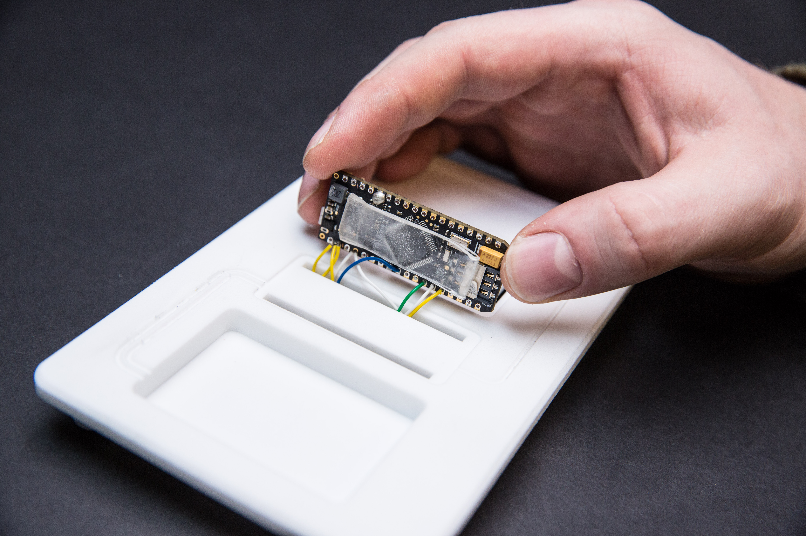
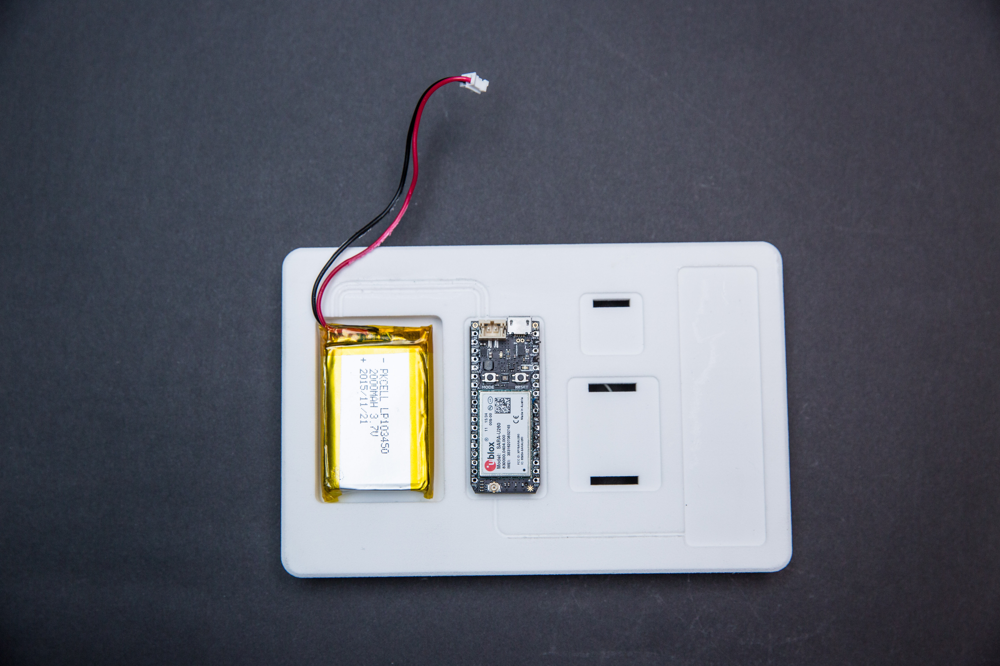
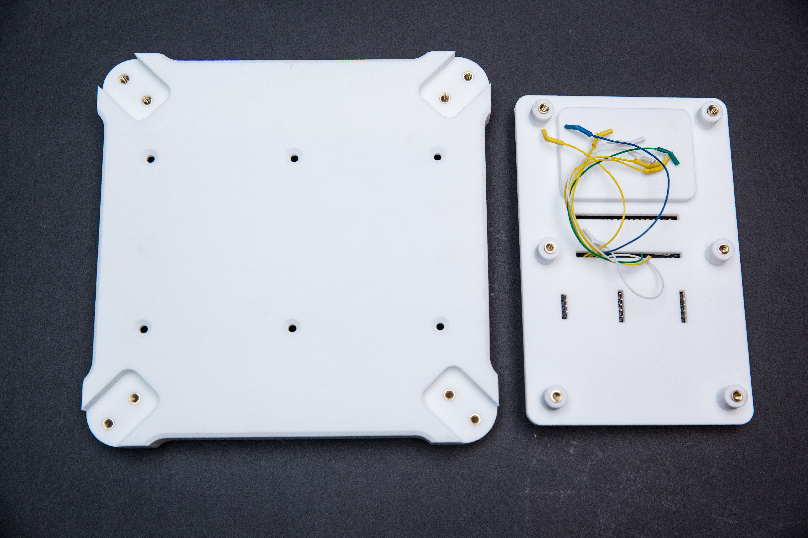
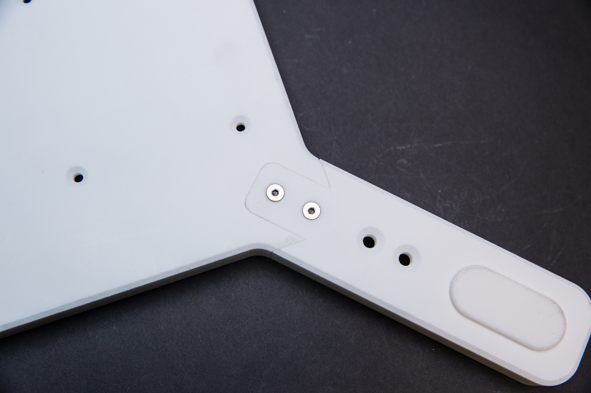
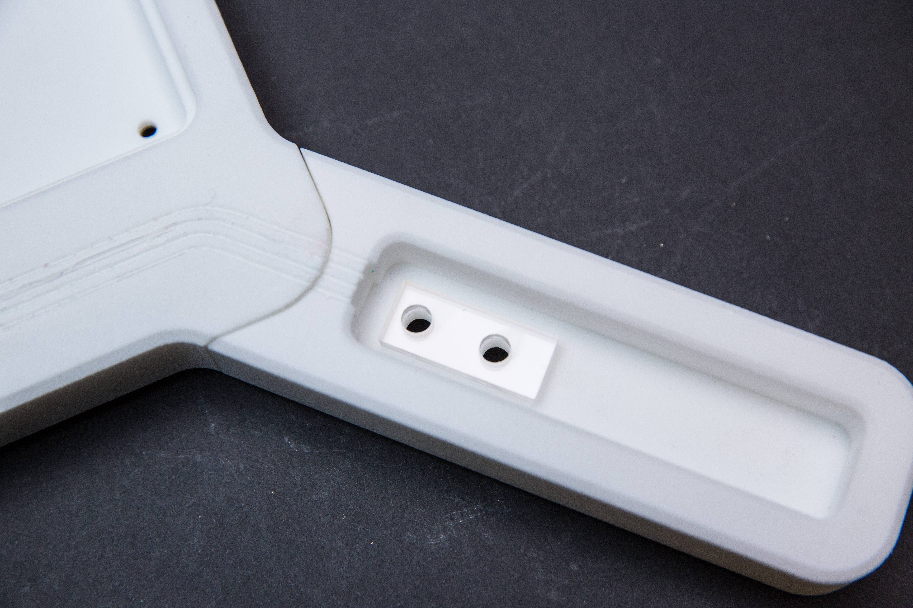
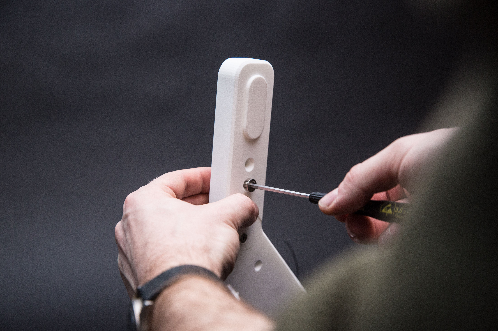
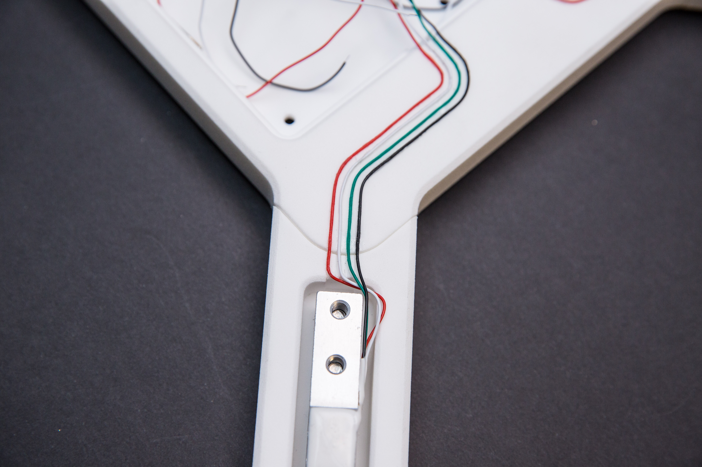
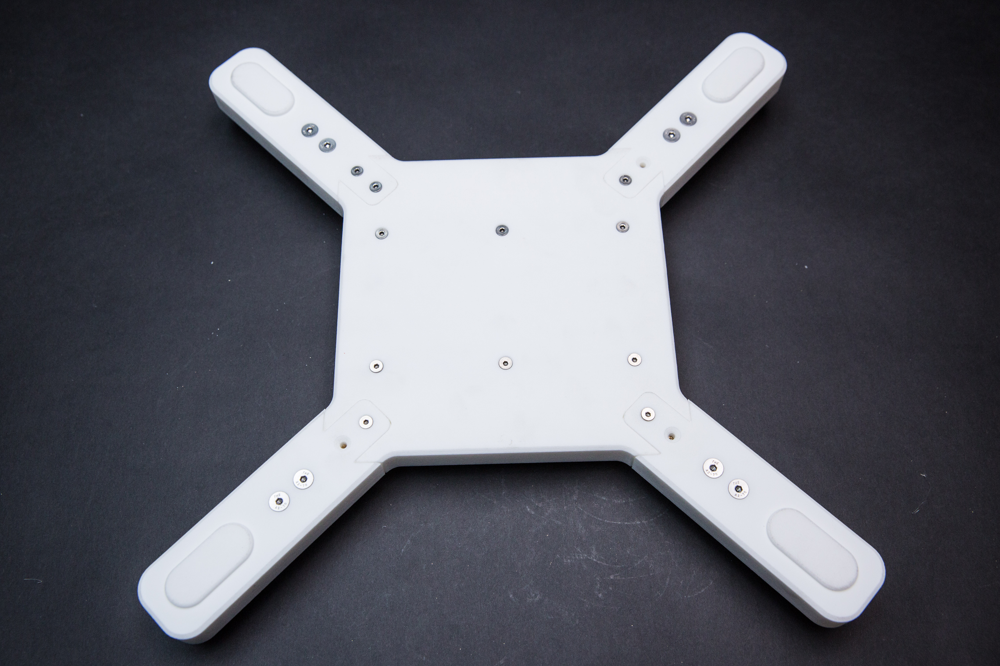

# Industrial Sensor
### Build A Realtime Coffee Inventory Tracking
##### A partner Blueprint for [Particle Electron](https://www.particle.io)

**Disclaimer: The blueprints and information made available on this page are examples only and are not to be used for production purposes. Twilio disclaims any warranties and liabilities under any legal theory (including, without limitation, breach of contract, tort, and indemnification) in connection with your use of or reliance on the blueprints. Any liabilities that arise in connection with your use of these blueprints shall solely be borne by you. By accessing and downloading these blueprints, you agree to the foregoing terms.**

**Problem**  As a local coffee roaster grows, it's having trouble predicting how much to roast and when they should be delivering coffee to clients. Right now they operate on a fixed weekly schedule but if they had a better view into how their clients are using their coffee, they could be much more efficient.

**Solution** We'll create an easy to deploy "industrial sensor" device that is essentially a smart scale our roaster that you can give to clients. All of your client's coffee is stored on the industrial sensor and it wirelessly reports usage back to the roaster so they can see how fast coffee is being used, make better predictions about what they should roast, and deliver coffee exactly when their clients need it. Our connected scale has a maximum capacity of 80lbs.

**Degree of Difficulty (1-5): 4** This example requires some basic electrical knowledge and the ability to solder, but otherwise the project is appropriate for a novice.

### Other Applications
You may not be running a coffee company, but this project will be of interest to anyone who wants to remotely monitor inventory or environment, from tracking the volume of water in a tank to the humidity in a warehouse.

### What You'll Need
Before we get started, here's a quick overview of what you'll need to build the Industrial Sensor:

**Electronic Components** In order to build your own Industrial Sensor, you'll need the following items:

* 1x [Twilio Programmable Wireless SIM](https://www.twilio.com/wireless)
* 1x [Particle Electron](https://www.particle.io/products/hardware/electron-cellular-dev-kit)
* 4x [HTC-Sensor TAL220 Load Cell](https://www.sparkfun.com/products/13329)
* 1x [Avia HX711 Load Cell ADC Breakout](https://www.sparkfun.com/products/13879)
* 1x [Silicon Labs SI7002 Temperature and Humidity Sensor Breakout](https://www.sparkfun.com/products/13763)
* 1x [Taoglas PC104 Penta Band Cellular Antenna](http://www.digikey.com/product-detail/en/taoglas-limited/PC.104.07.0165C/931-1256-ND/4250302)
* 1x [Lithium Ion Battery](https://www.adafruit.com/products/2011)

**Other Hardware** You're free to modify the physical build of your Industrial Sensor to fit your needs. Here's what you'll need to build our version:
* 8x [M5x18 flat head socket cap screws](https://www.mcmaster.com/#92125a213/=15urx90)
* 4x [M4x10 flat head socket cap screws](https://www.mcmaster.com/#92125a190/=15urxo7)
* 14x [6-32x5/8” flat head socket cap screws](https://www.mcmaster.com/#92210a150/=15urx2k)
* 8x [6-32 threaded inserts](https://www.mcmaster.com/#92395a113/=15urxf9)
* 6x [4-40 threaded inserts](https://www.mcmaster.com/#92395a112/=15us0uq)
* 1x [Bob Smith 103 Insta-Cure 2oz Super Thin Glue](https://www.amazon.com/Bob-Smith-Insta-Cure-Super-Thin/dp/B001NI4JWI)

**(Optional) Custom-Fabricated Parts** The industrial sensor construction is comprised of two major components: the base and top surface. The base holds all of the on board sensors and electronics, while the top surface will provide a place to store the monitored product. These two components can be made of any number of materials, but we decided to make ours out of a 3D-printed base with a laser cut and etched acrylic top surface.

**(Optional) 3D-Printed Parts – The Base** In addition to the electronic components and mechanical hardware, the body of the Industrial Sensor is 3D-printed.
You can download the [3D CAD Models here](models/).
You will need one print each of the central house base and electronics panel. However, you will need four prints of the [base arm](models/02%20Arm.STL) and [load-cell standoff](models/04%20Spacer.STL).
Using this 3D CAD model, you have a few options for building:
* Print it, if you have access to a 3D printer.
* Alternatively, if you don't have access to 3D printer or want to ensure quality, you could use a third-party 3D printing service. We recommend [Sculpteo](http://sculpteo.com) or [Voodoo Manufacturing](https://www.voodoomfg.com).

**(Optional) Laser Cut Parts - Top-Plate and Load-Cell Risers** The Industrial Sensor has a 14"x14" piece of quarter inch thick acrylic that acts as a top-plate surface and four small pieces of the same material used as load-cell risers. You will need to make these parts as well.
You can download the [CAD models here](models/).
As with the body, you can make the panels yourself based on the designs or choose to use a third-party service. We again recommend [Sculpteo](http://sculpteo.com).

_Whether you are printing and cutting yourself or using a service, **double check the units and dimensions of all parts after uploading**._

**Server Software** You'll either need a free ThingSpeak account or a server where you can run our simple NodeJS backend.
### (Optional) Finishing

**(Optional) 3D-Printed Parts** Surface finishes and residues left on the parts will vary depending on the type of printer or service used to produce them. Third-party producers should produce finishes to specification and clean parts before they ship, but prints done yourself will require special attention.
* Always be sure to clean parts thoroughly according to the printer manufacturer’s directions. Double-check hard-to-reach areas like screw holes; these areas may need to be scraped out.
* Check to make sure that there are no remaining residues that could prevent adhesives or glues from performing adequately. If you are able to scrape material off a surface with your fingernail, it is likely that any adhesive used in that area will be unreliable.
* For cosmetic finishing in these areas, diligent 400-grit wet sanding will clean off the residue and leave a smooth, matte surface.
* For areas that will be covered by wires or electronic components, residues must be sanded or scraped off before assembly can begin. Any small, hard steel tool can be used (dental picks and chisels work well.) Don’t worry about the appearance, as these areas will be covered after assembly.

**(Optional) Laser-Cut Parts** If you have access to a table router with a 45° chamfer bit, adding a small bevel to the edges of the acrylic top-plate can clean up the appearance of the part.

### Let's Build It!
#### Assemble the Electronic Components.

**Step 1a: Desolder and remove all headers from Electron.**

* **Remove the black plastic material from the headers** (or cut the headers on the underside of the board).

* **Apply heat to the soldered end of the pin** while pulling the other side of the pin with pliers.

* **Use desoldering braid** to clean the remaining solder from the hole.

* **For more information about desoldering**, check out [this article on Instructables](http://www.instructables.com/id/The-Ultimate-Guide-to-Desoldering/).

**Step 1b: Solder the wires to Electron.**

* **Flip the Electron to the backside**, where the SIM card slot is.
* **Slip the wires into this side of the board.** You will want the wire to ultimately drape from the bottom of the board.

* One end of the wire has a push-to-fit connector meant for pins on circuit boards and the **other end must be stripped for soldering.** (Suggestion: Strip about ½” off the ends of the wires, place them through the hold and bend them. The easiest way is to hold the wire from the top.)
* **Solder single wires to the spots labeled: C4, C5, D0, D1.**
* A bit further down the same side, **solder two wires into the spot labeled GND and three wires to 3V3.**

**Step 1c: Install the SIM card.**

* Typically SIM cards come in a few adjustable sizes. In this case, you will want to break the SIM card down to its smallest size.

* When you slip it into the Electron, the contact side should be facing the connectors on the PCB. **Slide the card in until it stops.**

 

**Step 1d: Attach electronics to the panel.**

* In the collection of 3D-printed parts for the base, you will find the rectangular [component plate](models/03%20Electronics%20Panel.STL). We will install most of the electronic components into the pockets on the top of this panel.

* The Electron has to be placed in the panel’s central location that has two slots. **Gently slip the wires soldered to the electron through the top slot.** Once those are through, feel free to **place a strip of 3M VHB or similar double-sided foam adhesive on the bottom of the electron**—to hold it in place.

**Step 1e:  Attach the Battery.**
* Above the electron board’s location is a shallow pocket meant for the battery pack. Make sure the battery’s leads extend off the top right corner of the battery. It may also be helpful to **tape or glue the battery down** in this location now.
* You will want to **run the battery’s wires down the two tracks at the top corner of the battery pocket down to the Electron board**.
* Place **dabs of glue periodically down the track** to hold the wires in place. This keeps the wires looking neat.

**Step 1f: Attach load cell amp.**
* The small PCB with the name “Load Cell Amp” connects to the smaller of the two slot positions on the electronics panel.
* **Align the words** so you can read them.
* **Add adhesive to the bottom of the board** to affix in place.

**Step 1g: Attach temperature and humidity sensor.**
* The temperature and humidity sensor board can only pass the pins through the electronics panel in one orientation. Place it through.
* You can also **add adhesive to the bottom of the board.**

**Step 1h: Attach Taoglas PC104 Penta Band Cellular Antenna.**
The Taoglas PC104 Penta Band Cellular Antenna is easy to install. On the back is a 3M self adhesive strip. **Remove the protection layer and attach the antenna** so that the words are readable and aligned.

* **Fold the antenna wire lead to the left**, then lay the wire in the track in the electronics panel, adding glue along the way to keep it all in place.

* When you get near the end, **take the antenna wire lead and connect it to the Electron’s antenna port** on the left.

**Step 1i: Connect to the load cells.**
* There are four load-cells in the Industrial Sensor. **Take the the same color wires from each load cell and combine them together** using some heat shrink tubing and a crimp-on push pin connector. (**Note: Solder the push pin connector where the wires sit.**)
* **Repeat for all the colors.**
* Then, **connect the colored wire bundles to the appropriate pins** on the load cell amp. You will see them labeled RED, BLK (Black), WHT (White), GRN (Green) from the top of the board. **Connect them from underneath.**

**Step 1j: Wire the backside of electronics panel.**
* After all the glue is dry, go on to attach the pin-connector ends of the electron's wires to the correct pins on the other boards **per the diagram below.**
* **Check and recheck to make sure all the connections are correct**. If so, set aside the electronics panel for now.

**Step 2. (Optional) Create a ThingSpeak account.**
* To start out, we're going to send the data from our Industrial Sensor to ThingSpeak. In order to do that, you'll need to [create a free account](https://thingspeak.com/users/sign_up).
* Once you’ve setup your account, you’ll need to **create the "channel"** that our Industrial Sensor will send the data to. [You can create a new channel here](https://thingspeak.com/channels) by clicking on the "New Channel" button.
* **Name your channel** whatever you would like and **enable three fields**: Field 1, Weight; Field 2, Temperature; Field 3, Relative Humidity.
* Once you've enabled your fields, **click save** and you should see your channel with three empty data fields.
* We will need to grab two pieces of data from ThingSpeak so that we can integrate it with our Industrial Sensor: the channel ID and API key. Find your channel ID at the top of your channel page; your API key can be found on [your account page](https://thingspeak.com/account).
* **Save those two strings somewhere**; we’ll need them for the next step.

**Step 3: (Optional) Update and Upload the ThingSpeak Firmware.**
* Now we'll put the firmware on the electron that will handle reading the values from our sensors and sending them to ThingSpeak. [Download our simple example code here](electron/electron_thingspeak.ino) and **open it in your favorite text editor**.
* You'll need to replace two values on lines 13 and 14. **Replace the placeholders in the code with the real values** for channel ID and API Key that you grabbed from ThingSpeak in the previous step.
* That's all that you need to do with the code; go ahead and upload to your electron. If you're interested in the details about exactly what this code is doing, [check out this walkthrough](electron/readme.md).

**Step 4: (Optional) Test Communication with ThingSpeak.**
* We should be able to run a test now to ensure everything is communicating properly. **Open up the overview page** for your ThingSpeak channel and **power on your Industrial Sensor hardware**. If things are working, you should see raw data coming across on the ThingSpeak dashboard.
The code on the electron should be sending data every 15 seconds. **Try placing some weight on the load cell and check to make sure the values change** on ThingSpeak. If so, great—we're all set up!

#### Use a Custom Backend to Receive Data.
ThingSpeak provides a quick, easy-to-use endpoint for our data but you'll probably want to send it somewhere else eventually. We have a sample server that will accept and display the data just like ThingSpeak does but should get you well on your way to your own custom app.
[You can find the code and instructions for this custom app here.](node/readme.md)

#### Assemble the Hardware

**Step 5: Build the Industrial Sensor hardware.**
The Industrial Sensor base and top surface can be made of any number of materials, but we decided to make ours with a 3D-printed parts and acrylic.
Again, while we chose a 12”x12” footprint for our device, this can be adjusted to accommodate a variety of dimensions.
* The first step is to build the base. At the simplest level, the base must have hole features for each load sensor, guides for wiring, and mounting pass-through for each electrical component. Specs for hole sizing and placement dimensions can be referenced in the [attached dxf’s.](models/)
* We **3D-printed all the parts of the base and laser cut/etched the top-plate**. However, similar parts can be made with CNC equipment or any number of common analog tools – if you are feeling ambitious.
* After the base is complete and all features are accounted for, you can make the top surface. **The top surface can be made of any square piece of rigid material that dimensionally matches the base.**
* On the underside of the top surface, we **etched four shallow pockets for the load-cell standoffs**, these keep the top surface securely in place while also making it easy to remove.

After you make all of the parts, here is how you put them together:

**Step 6: Install the threaded inserts.**
* The 3D-printed parts consist of a [central piece](models/01%20Center%20Piece.STL), [four arms](models/02%20Arm.STL), four small [surface spacers](models/04%20Spacer.STL), and the [electronics panel](models/03%20Electronics%20Panel.STL). On the bottom of the center piece and electronics panel, you must install the 6-32 threaded inserts. 8 threaded inserts in total will go in the corner pockets on the back of the central housing. On the electronics panel 4-40 threaded inserts will go on the bottom. Six threaded inserts in total will go in the standoff holes. **Make sure the knurled ends go into the holes first.**

* **Push firmly with your fingers** until they stay in place. Then **tap them in with a punch or nail set and a light hammer**. You want the inserts to be flush with the surface they are sunk into.

**Step 7: Install the Industrial Sensor arms.**

* **Flip the center piece upside-down and lay the four arms into their pockets at the corners. They should be snug but should not require much force to push in. Use the 6-32x5/8” machine screws to attach them.** 
They will require a hex wrench.

* When done, **flip the assembly over to the top side.**

**Step 8: Lay the electronics into place.**
* **Take the electronics panel and connected load-cells over to the base assembly.** 

* Lay the electronics panel into its pocket; it can only be installed in two orientations and either way is fine.

* Alternatively, **feel free to disconnect the load-cells from the electronics panel and put the electronics panel elsewhere.** It might make it easier to install the load-cells into the base legs. This is what we have done in the images below, to more clearly show the process.

**Step 9: Attach the load cells to the base arms.**

* There are four quarter inch acrylic load cell spacers with two holes in each. You will notice that the holes are closer to one side of the piece. **Place a piece into the base arm pocket.** This will go underneath a load-cell. The longer end will need to point away from the center of the base.

* This is where you must attach the load-cell. Place the load-cell on top of the acrylic piece with the end with the arrow sticker facing away from the center of the base and the arrow pointed down.

* Now, you will need to attach the load-cell to the body through the polycarbonate piece using two M5x18mm machine screws from the bottom. There are two ways to do this:
  1) **extend the arm off the edge of a table and screw them down from the underside.**
  2) If you have disconnected the loadcells from the rest of the electronics, you can **stand up the whole works to do it** – but you will have to make sure all the parts do not fall apart. Either way, be careful!
  
 
  
* The M5x18mm screws will pass through the acrylic piece and thread into the load-cells.
* **Repeat all of step 9 for all four load-cells.**

**Step 10: Route load-cell wires.**
* Now, you should **lay the load-cell wires into the tracks running from the arm pockets to the central housing pockets.** We recommend you do it with all the wire in the same pattern.
* **Dab some glue along the way** to make sure the wires stay.

* Once you reach the central housing pocket, **make sure the wires go down into the pocket.** There is a small gap between where the wires enter the pocket and where the electronics panel sits. There should be no pinching of the wires!
* **Make sure any excess length of wire is bundled up nicely under the electronics panel.**

**Step 11: Attach the top-plate standoffs.**
* At the ends of each load-cell, **attach one of the four standoff cups** with the large opening facing up. **Use one M4x10mm machine screw to thread it down onto the load-cell.**

* If you separated the load-cells from the electronics panel, you can now **reconnect the load-cell wires to the load cell amp.** Make sure you are placing the wires onto the correct pins. **Refer to the wiring diagram in the electronics assembly section.**

**Step 12: Attach the electronics panel.**

* After the load-cells are installed, you can **attach the electronics panel to the center piece.**
* From the bottom side, **lay the electronics panel into place; use the 6-32x5/8” screws to hold it down.**
* At this point, **plug the battery into the Electron.**

**Step 13: Align the top surface.**
* The plastic surface **simply lays on top of the load-cell standoff cups**. The side of the top-plate with the shallow circular pockets should point down and will lock up with the spacers. If they do not, **carefully flip the whole assembly over** so the plastic surface is on the table and the base is upside-down. You should now be able to **loosen the screws holding each load cell very slightly and nudge them until each spacer registers with its pocket in the top surface.** Then flip the assembly upright again.

